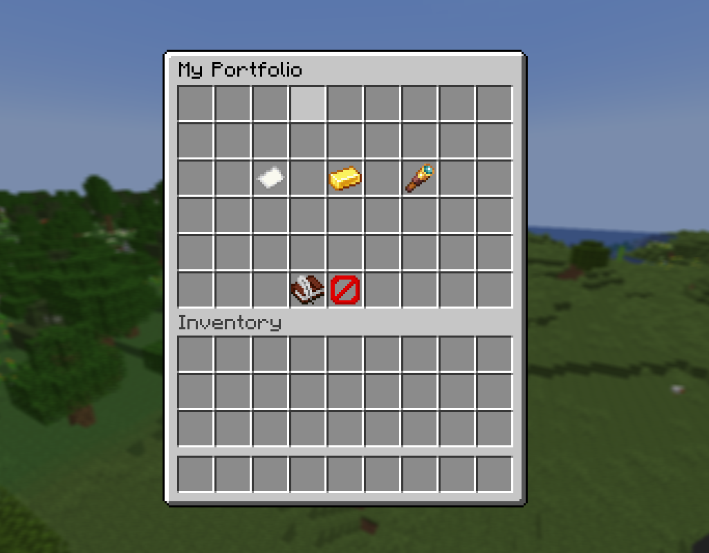
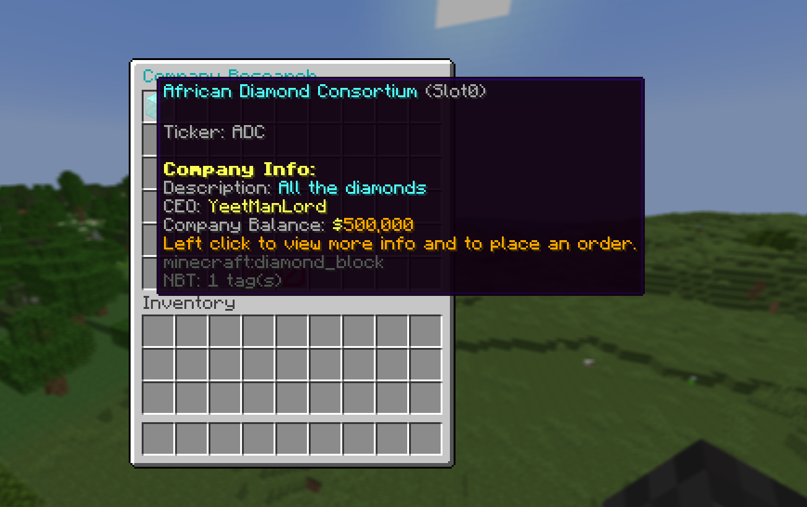
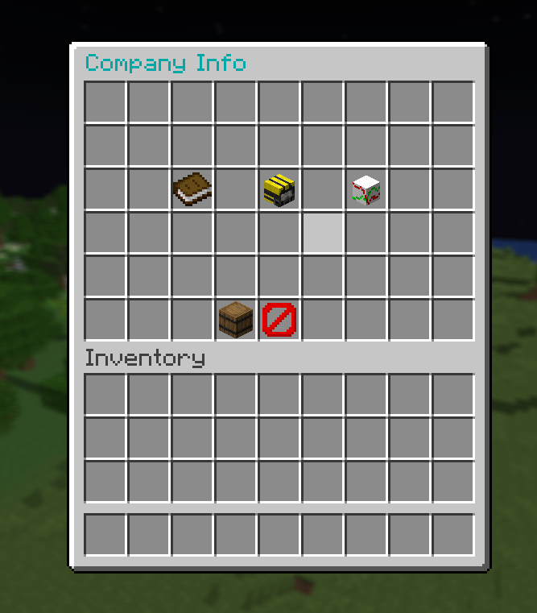
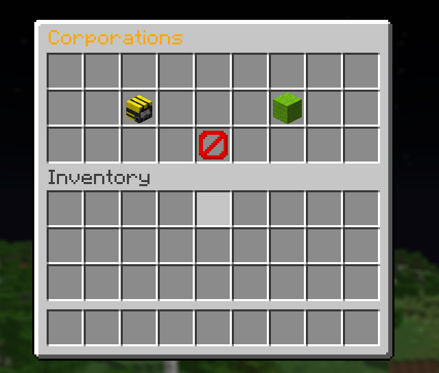
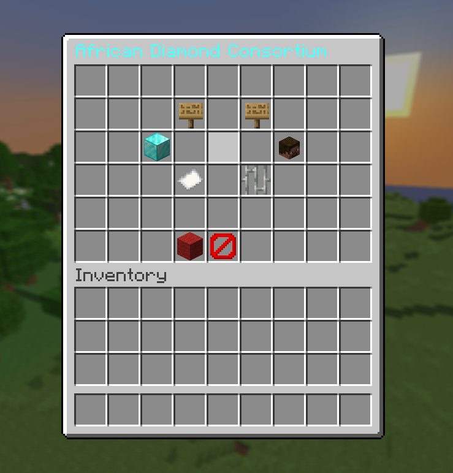
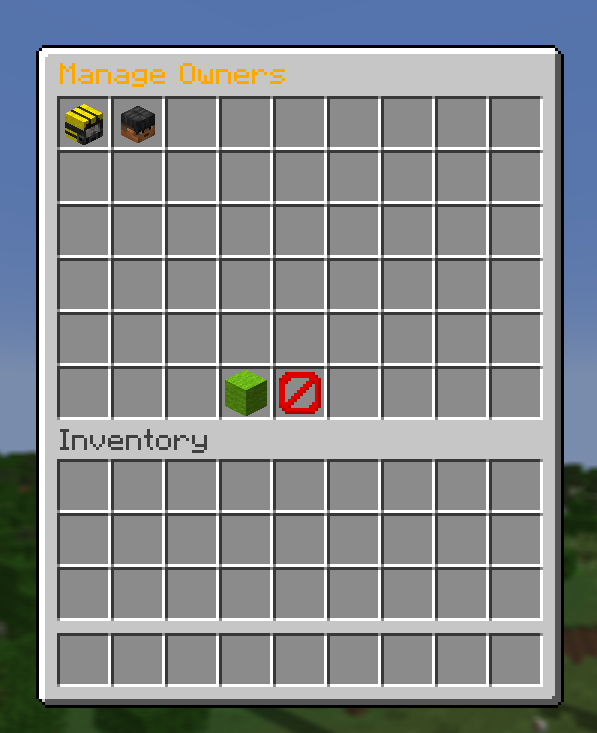
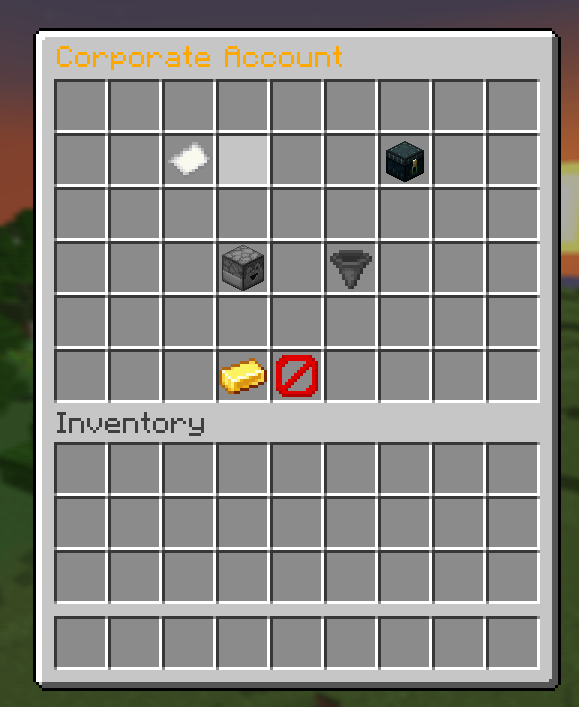
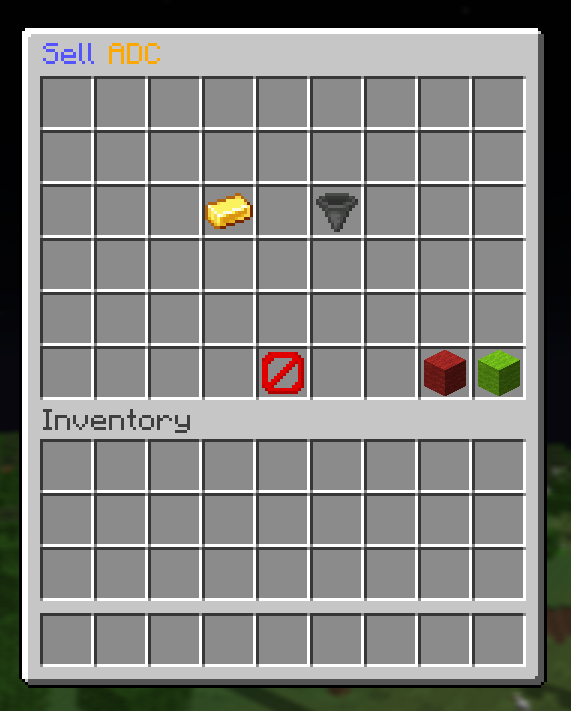
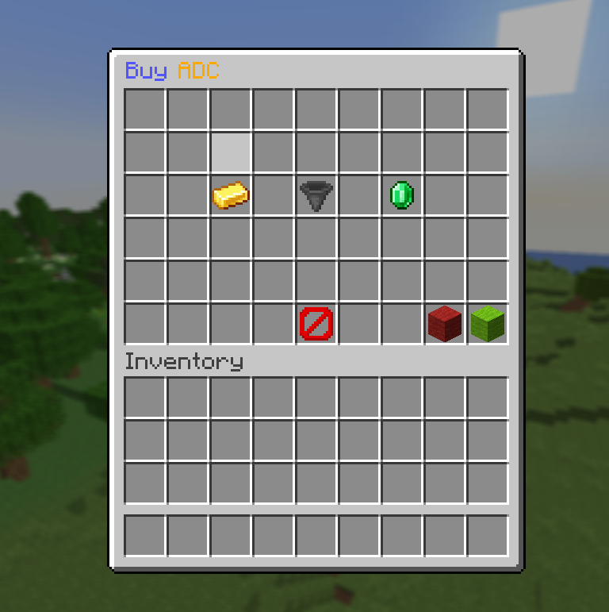

# ZetaCorp
 A Minecraft plugin to simulate the stock market. Create and invest in player-owned companies.

 This depends on another plugin of mine [ZetaCore](https://github.com/YeetmanLord/ZetaCore) as this contains all the core logic for data storage and GUI menus. It also acts as a management tool to turn on debug features and connect to an SQL database. (This doesn't support SQL right now, but that can be done if necessary.) 

 This plugin also depends on [Vault](https://www.spigotmc.org/resources/vault.34315/) to hook into economy plugins.

## Contents
- [How it works](#how-it-works)
- [Your Portfolio](#your-portfolio)
- [Creating and Managing Companies](#creating-and-managing-companies)
- [Buying/selling stocks](#buyingselling-stocks)

## How It Works
This plugin simulates the stock market by taking advantage of realistic supply and demand. Players can create and invest in various companies. Company owners and CEOs can issue shares and pay out dividends.

### The Basic Process
1. A player creates a company and issues shares at a specific price.
2. Investors can then buy shares in that company introducing new shares into the market.
3. Investors then can sell their shares creating a market based on supply and demand
4. The 2 order types (limit and market) determine what the price of the stock should be
5. Market orders will buy any open limit orders
6. Limit orders will determine the base price of the stock with sell orders determining the minimum buy and sell prices.

### In-depth look
Let's take a specific example

1. Let's say Steve starts a company MineCorp. This company mines diamonds and sells them to make money
2. He issues 10000 shares at $5 a piece and incentivizes investors to buy the company because he'll pay out dividends on what he mines.
3. He can then use this investment to buy materials to make tunnel bores and such or pay people to mine.
4. Investors, like Alex, buys shares in MineCorp from the initially offered shares.
5. Say Alex wants to sell her shares for $8, so she place a limit order for $8.
6. After all the initial shares are bought up, Alex's order is the cheapest.
7. Say another player wants to buy some more shares, so he places a market order and buys Alex's shares.
8. Now this player has Alex's shares and she walks away with a 60% profit.

## Your Portfolio
To open your portfolio run `/portfolio` or `/stocks`

It will open a menu like this:

There are three sections as well as some basic statistics (the book and quill)
1. My Orders
2. My Stocks
3. Company Research

### My Orders
Lists all open orders and allows you to cancel them

### My Stocks
Lists all stocks you own and allows you to place sell orders

### Company Research
Allows you to search companies and see basic info. Clicking on a company icon will open it's info page where you can see the CEO, owners, and some basic info as well as place buy orders.

It looks like this:

Here is the info page:

## Creating and Managing Companies
To open this GUI you can run `/companies` or `/corps`

It will open a menu like this:

There are 2 parts:
1. Company Creation
2. My Companies (AKA company management)

### Company Creation
You must specify the name for your company. This name supports formatting codes using the `&` symbol so have fun with that!

Next you must specify a unique ticker symbol. This is at most 5 characters and must only be letters and numbers.

Once that's done you're good to go!

### Company Management
This is where you can manage your companies. You can see all your companies that you own or are CEO of.

Clicking on a company will open the company management menu:

In this menu you can change the company's name, description, and icon. However, you cannot change the ticker symbol. There are also sub-menus for adding owners and managing the corporate account.

Additionally, you can issue shares from this page or delete the company.
Deleting the company will pay out all shareholders and owners based on the company's bank account.

### Owners
You can add owners to your company. They can manage funds and issue shares. They will appear on the public owner's list for the company and will be paid out if the company is deleted.

Owners cannot add other owners. Only the CEO (Company creator) can do that.

### Corporate Account
This is where you can manage, deposit, or withdraw funds from the company's bank account. 

This is also where dividends are paid out from.

The menu looks like this:

There are two sub-accounts in the company's bank account:
1. Corporate Account
2. Shareholder Reserved Account

The corporate account is where all the company's accessible money is stored. It can be withdrawn from or deposited into.

The shareholder reserved account stores inaccessible money reserved for dividends and for when the company is deleted. This money cannot be withdrawn from. Additionally, 20% of deposits will be put into this account if enabled in the config. (This is default behavior)

### Issuing Shares
Issuing shares is how companies get initial investments. Half of investments go to the company's bank account and the other half goes to the shareholder reserved account. (Unless specified otherwise in the config).

When issuing shares, you must specify the amount of shares to issue and their price. The price is per share.

## Buying/Selling Stocks
There are two types of order:
1. The Market Order
2. The Limit Order

### Market Order
This is the simplest order. It will buy any open limit orders at the cheapest price. If there are no open limit orders, it will try to buy issued shares. If there is nothing to buy, the order is automatically cancelled, and the buyer/seller is notified. 

Note about market orders: Because there can be price fluctuations when buying there is a required amount of extra cash you have to have to place an order (Default is 10%).

Say you want to buy 100 shares of a company at $10 a share. You need to have $1100 in your account to place the order. This is to prevent people from placing orders they can't afford. If the price fluctuates too much, some shares may be bought but if you do not have enough money the order will be cancelled automatically.

### Limit Order
This is the basis of pricing. If you've played Hypixel Skyblock, it's the same as placing and order on the Bazaar except with stocks.

If you have a sell order, the limit order's price will determine the absolute minimum price to sell and will get that price or better (more than that price).

If you have a buy order, the limit order's price will determine the absolute maximum price to buy and will get that price or better (less than that price).

### The Order Screen
This can be accessed by clicking on stocks in the My Stocks page or by clicking on the place order button in the company research page.

It looks like this for market orders:

And like this for limit orders:

You can specify a quantity and price. The price is per share. The quantity is the amount of shares you want to buy or sell.

## Permissions
- `zeta_corp.corporation` - Allows you to create and manage companies
- `zeta_corp.portfolio` - Allows you to view your portfolio and place orders
- `zeta_corp.admin` - Allows you to use the config command to configure the plugin
- `zeta_corp.trading_guide` - Allows players to run the `/trading_guide` command to get some info on this plugin including various definitions and explanations of how things work.

## Commands
- `corporations`, `corps`, or `company` - Allows players to configure their companies
- `portfolio`, `stocks`, or `my_portfolio` - Allows players to view their portfolio and place orders
- `trading_guide`, `guide`, or `investing_guide` - Allows players to get some helpful information when it comes to this plugin.
- `zeta_corporations` or `zetacorp` - Allows admins to configure the plugin

## Config
| Config Option | Description | Default Value |
| ------------- | ----------- | ------------- |
| marketOrderMargin | The percentage of the company's ask price that must be accounted for when buying shares since the price is not guaranteed | 10% (0.1) |
| maxSharesIssued | The maximum amount of shares that can be issued by a company | 2,500,000 |
| maxSharesIssuedAtOnce | The maximum amount of shares that can be issued at once by a company | 1,000,000 |
| maxShareIssuePrice | The maximum price that shares can be issued at by a company | $1,000.00 |
| shareholderReservePercent | The percentage of the company's deposits that are reserved for shareholders (From issuing shares specifically) | 50% (0.5) |
| reservePortionOfDeposit | Determines if 20% of deposits should be reserved for shareholders. | True |